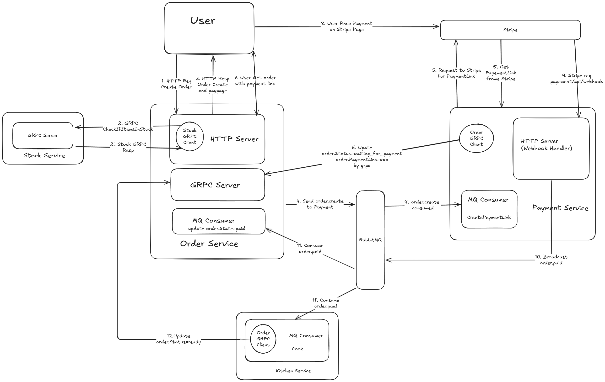

# Startup Instructions

```bash
gorder/
├─ docker compose up -d
├─ stripe listen --forward-to localhost:8284/api/webhook
├─ cd gorder/internal/stock    && air .
├─ cd gorder/internal/order    && air .
├─ cd gorder/internal/payment  && air .
└─ cd gorder/internal/kitchen  && air .
```

---

# Project Structure

## Order Service

**HTTP Server**

- Handles user requests such as `CreateOrder`, `GetOrder`, etc.
- Queries stock availability via `StockGRPCClient`.
- Sends `order.create` events to the MQ to notify the Payment Service.

**gRPC Server**

- Handles gRPC requests from the Payment Service and Kitchen Service, mainly to update order statuses (e.g., paid, cooked).

**MQ Consumer**

- Listens for `order.paid` events broadcasted by the Payment Service and updates the order status to `paid`.

---

## 💳 Payment Service

**HTTP Server (Webhook Handler)**

- Receives Stripe Webhook callbacks when a user completes payment and broadcasts `order.paid` events via MQ.

**MQ Consumer**

- Listens for `order.create` events sent by the Order Service.
- Requests a Payment Link from Stripe.
- Uses `OrderGRPCClient` to update `order.Status` to `waiting_for_payment` and sets `order.PaymentLink`.

---

## Stock Service

**gRPC Server**

- Handles gRPC requests from the Order Service to query and deduct stock levels.

---

## Kitchen Service

**MQ Consumer**

- Listens for `order.paid` events broadcasted by the Payment Service.
- Simulates the cooking process.
- Uses `OrderGRPCClient` to update the order status to `cooked`.

---

# 🛠 Tech Stack

- **Languages**: Go, HTML, JavaScript, Shell
- **Backend Framework**: Gin
- **Data Storage**:
  - MongoDB (stores order data)
  - MySQL (stores stock data)
- **Middleware**: RabbitMQ, Redis (for distributed locking)
- **Logging Tool**: Logrus
- **Monitoring & Tracing**: OpenTelemetry, Jaeger, Prometheus, Grafana

---

# Architecture & Design Patterns

- Implements **CQRS (Command Query Responsibility Segregation)**:

  - Separates read and write operations to improve scalability and performance.
  - Applies decorator patterns on each `CommandHandler` and `QueryHandler` to enhance functionality (e.g., logging, metrics collection).

- Incorporates **DDD (Domain-Driven Design)**:

  - Uses a rich domain model.
  - Business logic is aggregated within domain services, with data operations (Repository) decoupled from other operations (e.g., MQ, caching) for better maintainability.

---

# Project Notes

Make sure to **distinguish between business errors and system errors** to avoid logic confusion. For example, when unlocking a Redis distributed lock:

- Even if the business logic fails, always ensure the lock is released properly.
- Avoid overwriting system errors with business errors.

Sample code:

```go
func (h checkIfItemsInStockHandler) Handle(ctx context.Context, query CheckIfItemsInStock) (res []*entity.Item, err error) {
    var lkerr error
    lockKey := getLockKey(query)

    // Try to acquire lock
    if lkerr = lock(ctx, lockKey); lkerr != nil {
        return nil, errors.Wrapf(lkerr, "Redis lock error key=%s", lockKey)
    }

    // Ensure lock release
    defer func() {
        if lkerr = unlock(ctx, lockKey); lkerr != nil {
            logrus.WithContext(ctx).Warnf("Redis unlock failed key=%s err=%v", lockKey, lkerr)
        }
    }()

    // Query price information
    for _, it := range query.Items {
        priceID, err := h.stripeAPI.GetPriceByProductID(ctx, it.ID)
        if err != nil {
            logrus.WithContext(ctx).Warnf("GetPriceByProductID failed item_id=%s err=%v", it.ID, err)
            return nil, err
        }
        res = append(res, &entity.Item{
            ID:       it.ID,
            Quantity: it.Quantity,
            PriceID:  priceID,
        })
    }

    // Check stock levels
    if err := h.checkStock(ctx, query.Items); err != nil {
        return nil, err
    }

    // Log result
    fs := logrus.Fields{
        "query": query,
        "res":   res,
    }
    logrus.WithContext(ctx).WithFields(fs).Info("checkIfItemsInStock succeeded")

    return res, nil
}
```

---

# ✅ Summary

- 📝 **Logging**: Use structured logging (Logrus) and include trace\_id and other context information.
- 🕸️ **Tracing**: Combine OpenTelemetry and Jaeger to visualize request flows.
- 📖 **Architecture**: CQRS + partial DDD for clear, scalable, and maintainable code.

---

\*\*\*\*\*\*\*\*\*\*\*\*\*\*\*\*\*\*\*\*\*\*\*\*\*\*\*\*\*\*\*\*\*\*\*\*\*\*\*\*\*\*\*\*\*



\*\*\*\*\*\*\*\*\*\*\*\*\*\*\*\*\*\*\*\*\*\*\*\*\*\*\*\*\*\*\*\*\*\*\*\*\*\*\*\*\*\*\*\*\*
# 启动方法

```bash
gorder/
├─ docker compose up -d
├─ stripe listen --forward-to localhost:8284/api/webhook
├─ cd gorder/internal/stock    && air .
├─ cd gorder/internal/order    && air .
├─ cd gorder/internal/payment  && air .
└─ cd gorder/internal/kitchen  && air .
```

---

# 项目结构

## Order Service

**HTTP Server**

- 接收用户请求, 如 `CreateOrder`、`GetOrder` 等. 
- 通过 `StockGRPCClient` 查询库存. 
- 向 MQ 发送 `order.create` 事件, 通知 Payment Service. 

**gRPC Server**

- 接收 Payment Service 和 Kitchen Service 的 gRPC 请求, 主要用于修改订单状态 (如已支付、已出餐等) . 

**MQ Consumer**

- 监听 Payment Service 广播的 `order.paid` 事件, 将订单状态更新为 `paid`. 

---

## Payment Service

**HTTP Server (Webhook Handler)**

- 当用户 (通过 Stripe) 完成支付后接收 Stripe 的 Webhook 回调, 通过 MQ 广播 `order.paid` 事件. 

**MQ Consumer**

- 监听 MQ 中 Order Service 发送的 `order.create` 事件. 
- 请求 Stripe 创建支付链接 (Payment Link) . 
- 调用 `OrderGRPCClient` 将 `order.Status` 更新为 `waiting_for_payment` 并写入 `order.PaymentLink`. 

---

## Stock Service

**gRPC Server**

- 接收 Order Service 的 gRPC 请求, 用于查询和扣减库存. 

---

## Kitchen Service

**MQ Consumer**

- 监听 Payment Service 广播的 `order.paid` 事件. 
- 模拟烹饪过程. 
- 通过 `OrderGRPCClient` 更新订单状态为 `cooked`. 

---

# 技术栈

- **语言**：Go, HTML, JavaScript, Shell
- **后端框架**：Gin
- **数据存储**：
  - MongoDB (存储订单数据) 
  - MySQL (存储库存数据) 
- **中间件**：RabbitMQ, Redis (分布式锁) 
- **日志工具**：Logrus
- **监控和链路追踪**：OpenTelemetry, Jaeger, Prometheus, Grafana

---

# 项目架构与设计模式

- 采用 **CQRS (命令查询责任分离) **：

  - 读写分离, 便于扩展和优化性能. 
  - 每个 `CommandHandler` 和 `QueryHandler` 使用装饰器模式增强功能 (如日志记录和指标采集) . 

- 融入 **DDD (领域驱动设计) **：

  - 引入充血模型 (Rich Domain Model) . 
  - 业务逻辑聚合在领域服务中, 数据操作 (Repository) 与其他操作 (如 MQ、缓存) 解耦, 提高代码可维护性. 

---

# 项目笔记

务必**区分业务错误和系统错误**, 避免逻辑混淆. 例如, 解锁 Redis 分布式锁时：

- 即使业务处理失败, 也要保证锁正确释放. 
- 不要用业务错误覆盖解锁错误. 

示例代码：

```go
func (h checkIfItemsInStockHandler) Handle(ctx context.Context, query CheckIfItemsInStock) (res []*entity.Item, err error) {
    var lkerr error
    lockKey := getLockKey(query)

    // 尝试加锁
    if lkerr = lock(ctx, lockKey); lkerr != nil {
        return nil, errors.Wrapf(lkerr, "Redis lock error key=%s", lockKey)
    }
    
    // 确保解锁逻辑执行
    defer func() {
        if lkerr = unlock(ctx, lockKey); lkerr != nil {
            logrus.WithContext(ctx).Warnf("Redis unlock failed key=%s err=%v", lockKey, lkerr)
        }
    }()

    // 查询价格信息
    for _, it := range query.Items {
        priceID, err := h.stripeAPI.GetPriceByProductID(ctx, it.ID)
        if err != nil {
            logrus.WithContext(ctx).Warnf("GetPriceByProductID failed item_id=%s err=%v", it.ID, err)
            return nil, err
        }
        res = append(res, &entity.Item{
            ID:       it.ID,
            Quantity: it.Quantity,
            PriceID:  priceID,
        })
    }

    // 检查库存
    if err := h.checkStock(ctx, query.Items); err != nil {
        return nil, err
    }

    // 日志记录
    fs := logrus.Fields{
        "query": query,
        "res":   res,
    }
    logrus.WithContext(ctx).WithFields(fs).Info("checkIfItemsInStock succeeded")

    return res, nil
}
```

---

# 小结

- **日志**：采用结构化日志(Logrus)并输出 trace\_id 等上下文信息. 
- **调用链**：建议配合 OpenTelemetry 和 Jaeger 观察调用流. 
- **架构**：CQRS + 部分 DDD, 代码更清晰、可扩展. 
